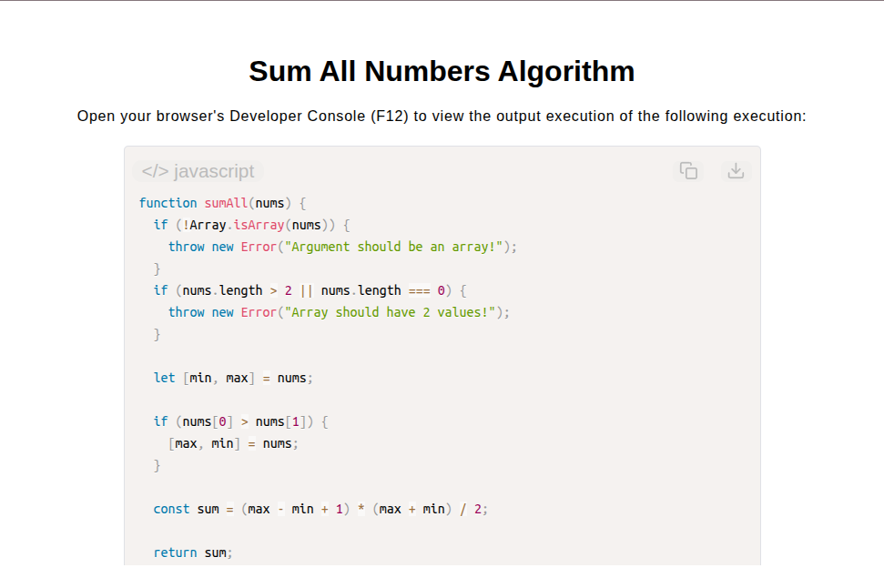

# Sum All Numbers Algorithm

[Live Demo](https://tefol-hub.github.io/freeCodeCamp-Projects-and-Certs/Javascript-Certification/sum-all-numbers-algorithm/)
[Lab Instructions](https://www.freecodecamp.org/learn/javascript-v9/lab-sum-all-numbers-algorithm/lab-sum-all-numbers-algorithm)

## 📸 Preview

## 🎯 Project Goals
* **Objective:** Calculate the cumulative sum of an inclusive integer range defined by a two-element array, regardless of initial element ordering.
* **Range Normalization:** Extracted boundary values using array destructuring while accounting for unsorted boundary inputs.
* **Constant Time Summation:** Applied Gauss's summation formula $((n / 2) \times (\text{start} + \text{end}))$ to achieve $O(1)$ optimal time complexity instead of linear loop iterations.
* **Defensive Parameter Validation:** Checked collection type structures (`Array.isArray()`) and exact length constraints.

## 🛠️ Technologies Used
* **JavaScript (ES6):** Array destructuring, mathematical operations, condition-based variable swapping, parameter validation.
* **HTML5 & CSS3:** Presentational user display framework.
* **Prism.js:** Automated syntax parsing and client-side code rendering.

## 🚀 How to Run
1. Navigate to: `cd Javascript-Certification/sum-all-numbers-algorithm`
2. Open `index.html` in your browser.
3. Access your **Developer Console (F12)** to test custom two-number range inputs.
