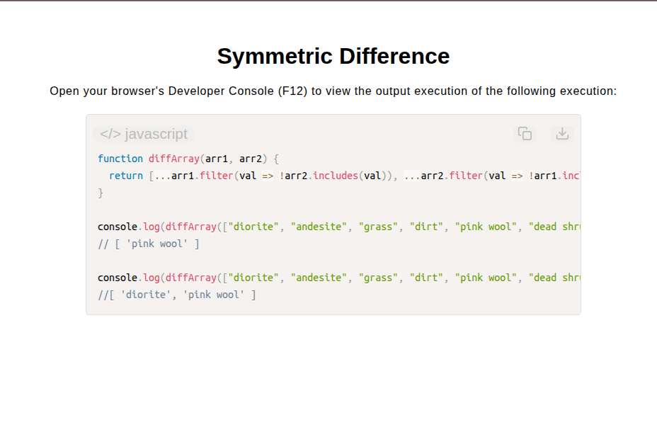

# Symmetric Difference Function

[Live Demo](https://tefol-hub.github.io/freeCodeCamp-Projects-and-Certs/Javascript-Certification/symmetric-difference/)
[Lab Instructions](https://www.freecodecamp.org/learn/javascript-v9/lab-symmetric-difference/lab-symmetric-difference)

## 📸 Preview

## 🎯 Project Goals
* **Objective:** Compare two input arrays and extract the symmetric difference—a collection containing elements unique to either array, excluding elements shared by both.
* **Higher-Order Array Filtering:** Leveraged `Array.prototype.filter()` paired with `Array.prototype.includes()` predicate tests to isolate distinct items.
* **Bi-Directional Evaluation:** Filtered items unique to `arr1` relative to `arr2`, then extracted items unique to `arr2` relative to `arr1`.
* **Collection Merging:** Merged filtered results into a unified return array using spread syntax (`[...arr1Only, ...arr2Only]`).

## 🛠️ Technologies Used
* **JavaScript (ES6):** Higher-Order Functions (`.filter()`), array membership checks (`.includes()`), spread syntax (`...`).
* **HTML5 & CSS3:** Presentational user display framework.
* **Prism.js:** Automated syntax parsing and client-side code rendering.

## 🚀 How to Run
1. Navigate to: `cd Javascript-Certification/symmetric-difference`
2. Open `index.html` in your browser.
3. Access your **Developer Console (F12)** to test custom array comparison pairs.
