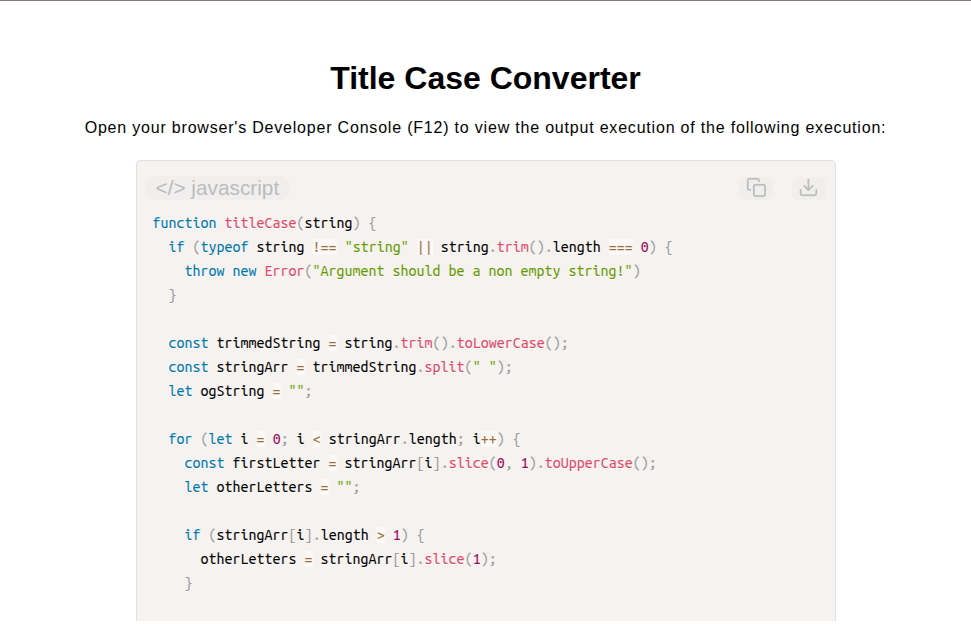

# Title Case Converter

[Live Demo](https://tefol-hub.github.io/freeCodeCamp-Projects-and-Certs/Javascript-Certification/title-case-converter/)
[Lab Instructions](https://www.freecodecamp.org/learn/javascript-v9/lab-title-case-converter/build-a-title-case-converter)

## 📸 Preview

## 🎯 Project Goals
* **Objective:** Parse string inputs and transform character casing so that the initial letter of every word is capitalized while remaining characters are converted to lowercase.
* **Case Normalization:** Standardized mixed-case inputs using string lowering (`.toLowerCase()`) prior to word-level capitalization.
* **String Substring Extraction:** Extracted initial character positions using `.slice(0, 1)` or `.charAt(0)` alongside trailing substring slices (`.slice(1)`).
* **Array Tokenization & Joining:** Split multi-word strings along delimiter spaces into arrays, transforming and reassembling tokens into formatted title case outputs.

## 🛠️ Technologies Used
* **JavaScript (ES6):** String methods (`.toLowerCase()`, `.toUpperCase()`, `.slice()`, `.split()`), array iteration, template concatenation.
* **HTML5 & CSS3:** Presentational user display framework.
* **Prism.js:** Automated syntax parsing and client-side code rendering.

## 🚀 How to Run
1. Navigate to: `cd Javascript-Certification/title-case-converter`
2. Open `index.html` in your browser.
3. Access your **Developer Console (F12)** to test custom text string inputs and case conversions.
