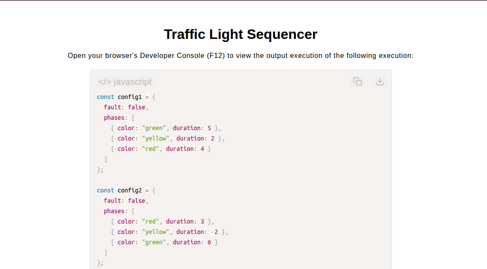

# Traffic Light Sequencer

[Live Demo](https://tefol-hub.github.io/freeCodeCamp-Projects-and-Certs/Javascript-Certification/traffic-light-sequencer/)
[Lab Instructions](https://www.freecodecamp.org/learn/javascript-v9/lab-traffic-light-sequencer/lab-traffic-light-sequencer)

## 📸 Preview

## 🎯 Project Goals
* **Objective:** Construct a simulation engine that processes configurable traffic light phase structures across repeating cycles and logs execution anomalies.
* **Control Flow Labeling:** Applied labeled loop break statements (`break cyclesLoop`) to halt multi-level nested loops immediately upon detecting fault flags.
* **Accumulated State Tracking:** Built timeline generation sequences that aggregate cumulative elapsed phase durations across repeating cycles into flat numeric arrays.
* **Anomaly Guarding:** Handled edge cases including empty phase arrays, negative/zero phase durations, and system fault signals.

## 🛠️ Technologies Used
* **JavaScript (ES6):** `for...of` loops, labeled loop controls, array accumulation, object property access, and string formatting.
* **HTML5 & CSS3:** Presentational user display framework.
* **Prism.js:** Client-side source code parsing and syntax highlighting.

## 🚀 How to Run
1. Navigate to: `cd Javascript-Certification/traffic-light-sequencer`
2. Open `index.html` in your browser.
3. Access your **Developer Console (F12)** to test configurations with varying cycle counts and fault triggers.

