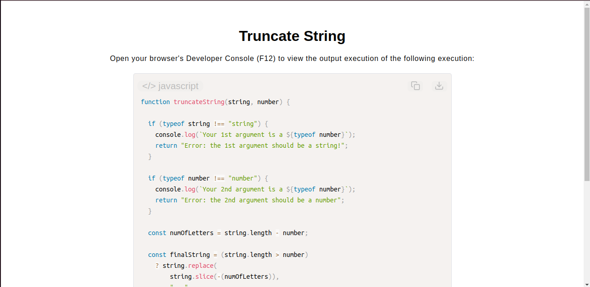

# Truncate a String Algorithm

[Live Demo](https://tefol-hub.github.io/freeCodeCamp-Projects-and-Certs/Javascript-Certification/truncate-string/)
[Lab Instructions](https://www.freecodecamp.org/learn/javascript-v9/lab-truncate-string/truncate-a-string)

## 📸 Preview

## 🎯 Project Goals
* **Objective:** Build an algorithm that shortens text to an explicit boundary constraint and appends an ellipsis (`...`) indicator if it exceeds the maximum allocation layout.
* **String Parsing Constraints:** Scaled dynamic character evaluation calculations by comparing variable string properties against boundary number thresholds.
* **Granular Type Auditing:** Designed explicit parameter gatekeeping blocks using `typeof` evaluation to log errors and stop illegal executions on mismatched inputs.

## 🛠️ Technologies Used
* **JavaScript (ES6):** String methods (`.slice()`, `.replace()`), validation formatting blocks, conditional ternaries, and length calculations.
* **HTML5 & CSS3:** Presentational user interface configuration container.
* **Prism.js:** On-the-fly syntax rendering and file extraction scripts.

## 🚀 How to Run
1. Navigate to: `cd Javascript-Certification/truncate-string`
2. Open `index.html` in your browser.
3. Bring up your browser's **Developer Console (F12)** to test custom truncation lengths against long sentences.

## Possible improvements
* Use a more effiecient and less error prone method for truncating string:
* const finalString = (string.length > number) 
*  ? string.slice(0, number) + "..."
*  : string;
