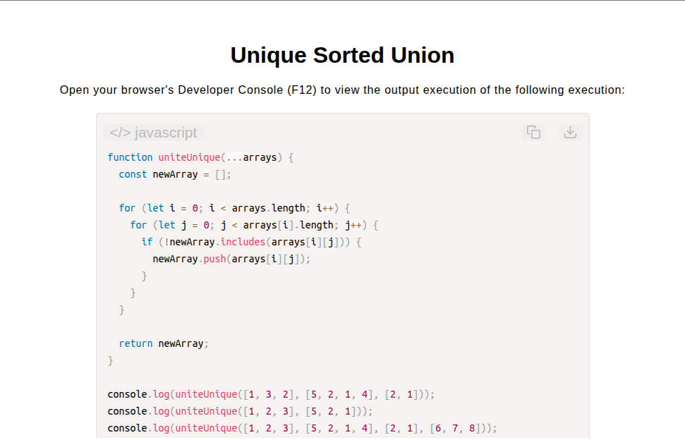

# Unique Sorted Union

[Live Demo](https://tefol-hub.github.io/freeCodeCamp-Projects-and-Certs/Javascript-Certification/unique-sorted-union/)
[Lab Instructions](https://www.freecodecamp.org/learn/javascript-v9/lab-unique-sorted-union/implement-a-unique-sorted-union)

## 📸 Preview

## 🎯 Project Goals
* **Objective:** Combine multiple array arguments into a single ordered array containing unique values, preserving original insertion sequence.
* **Variadic Argument Handling:** Collected an indefinite number of input arrays using ES6 rest parameter syntax (`...arrays`).
* **Insertion-Order Preservation:** Ensured elements are recorded upon their first appearance while ignoring subsequent duplicate occurrences across argument collections.
* **Array Inclusion Checking:** Validated element uniqueness using `.includes()` membership testing before appending values to the result set.

## 🛠️ Technologies Used
* **JavaScript (ES6):** Rest parameters (`...`), array traversal loops, `.includes()`, `.push()`.
* **HTML5 & CSS3:** Presentational user display framework.
* **Prism.js:** Automated syntax parsing and client-side code rendering.

## 🚀 How to Run
1. Navigate to: `cd Javascript-Certification/unique-sorted-union`
2. Open `index.html` in your browser.
3. Access your **Developer Console (F12)** to test multi-array union operations.
