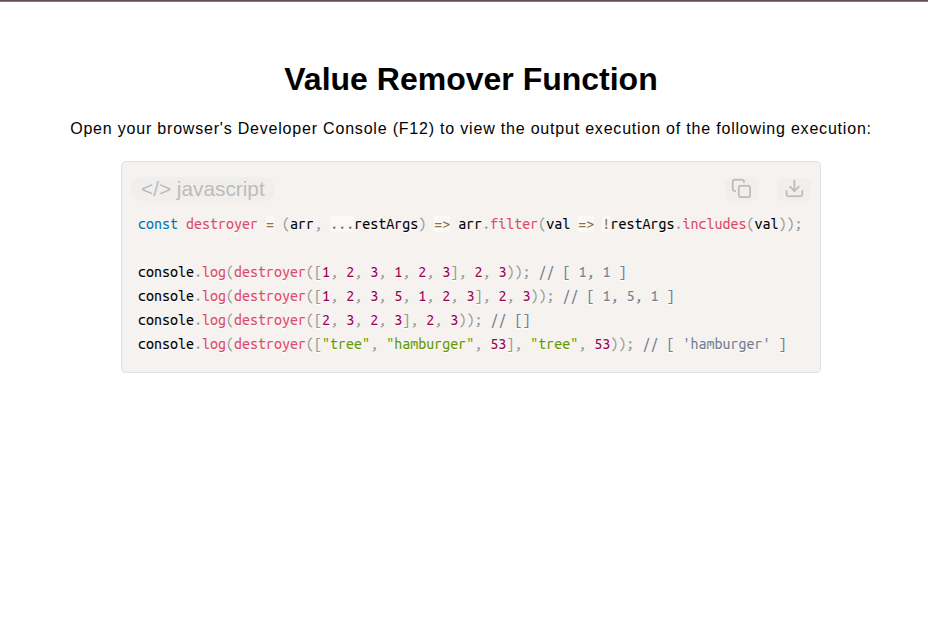

# Value Remover Function

[Live Demo](https://tefol-hub.github.io/freeCodeCamp-Projects-and-Certs/Javascript-Certification/value-remover-function/)
[Lab Instructions](https://www.freecodecamp.org/learn/javascript-v9/lab-value-remover-function/implement-a-value-remover-function)

## 📸 Preview

## 🎯 Project Goals
* **Objective:** Purge target values from a source array given an arbitrary number of removal arguments.
* **Variadic Argument Processing:** Leveraged ES6 rest parameter syntax (`...restArgs`) to capture an indeterminate count of trailing filter values into a single array.
* **Higher-Order Array Filtering:** Utilized `Array.prototype.filter()` paired with an `.includes()` lookup callback to isolate non-matching elements.
* **Immutable Extraction:** Retained input array purity by constructing and returning a newly allocated filtered array instance.

## 🛠️ Technologies Used
* **JavaScript (ES6):** Higher-Order Functions (`.filter()`), Rest parameters (`...`), array inclusion testing (`.includes()`), concise arrow functions.
* **HTML5 & CSS3:** Presentational user display framework.
* **Prism.js:** Automated syntax parsing and client-side code rendering.

## 🚀 How to Run
1. Navigate to: `cd Javascript-Certification/value-remover-function`
2. Open `index.html` in your browser.
3. Access your **Developer Console (F12)** to test custom target array filtering with variadic argument lists.
