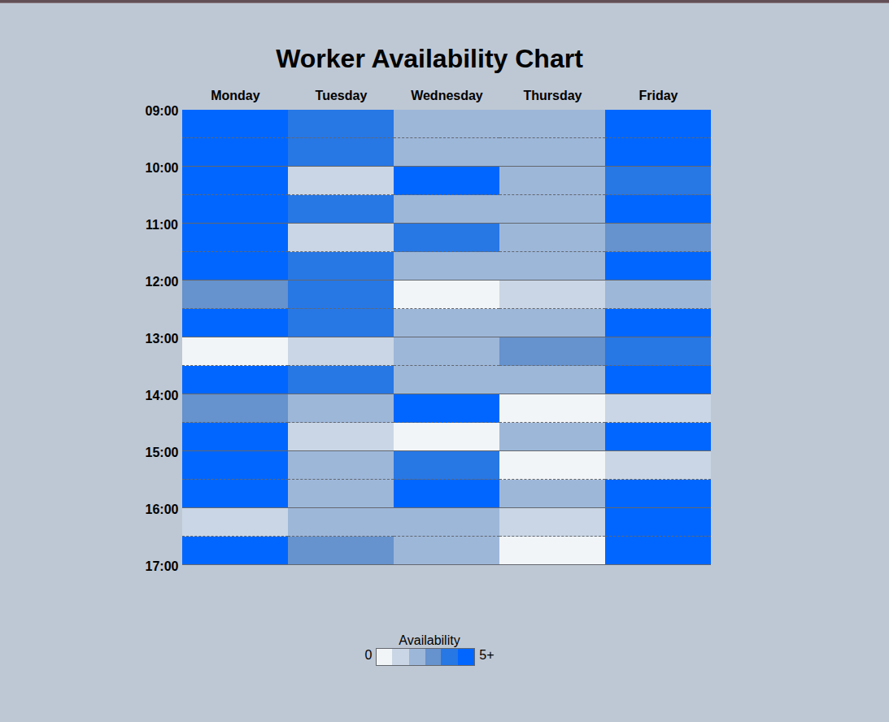

# Worker Availability Table

[Live Demo](https://tefol-hub.github.io/freeCodeCamp-Projects-and-Certs/Responsive-Web-Design-Certification/availability-table/)
[Lab Instructions](https://www.freecodecamp.org/learn/responsive-web-design-v9/lab-availability-table/build-an-availability-table)

## 📸 Preview

## 🎯 Project Goals
* **Objective:** Map structural data patterns and density charts using clean markup and modular styling.
* **CSS Architecture:** Leveraged CSS Custom Properties (`:root` variables) for quick global theme adjustments.
* **Visual Tricks:** Designed alternating solid and dashed row borders using structural component classes, alongside an accurate hard-stop gradient legend.

## 🛠️ Technologies Used
* **HTML5:** Semantic `<table>` layouts.
* **CSS3:** Custom properties, layout helpers (`visibility`), and hard-stop color gradients.

## 🚀 How to Run
1. Navigate to: `cd Responsive-Web-Design-Certification/worker-availability-chart`
2. Open `index.html` in your browser.