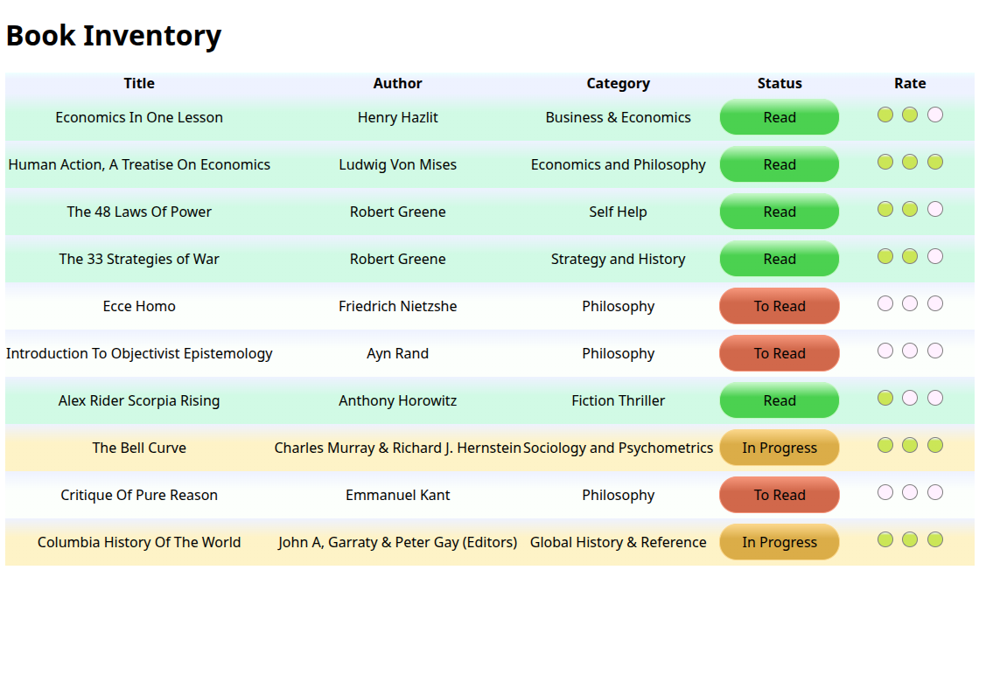

# 🏆 Book Catalog Table (Certification Project)

[Live Demo](https://tefol-hub.github.io/freeCodeCamp-Projects-and-Certs/Responsive-Web-Design-Certification/book-catalog-table-v2/)
[Lab Instructions](https://www.freecodecamp.org/learn/responsive-web-design-v9/lab-book-inventory-app/build-a-book-inventory-app)

---

## 📸 Preview

## 🎯 Project Goals
* **Objective:** Fulfill all core freeCodeCamp certification requirements for semantic tabular data display.
* **Key Feature:** Advanced structural selection using CSS attribute matchers (`^=`, `~=`) and mathematical pseudo-selectors (`:nth-of-type(-n+2)`) to build a dynamic star-rating system without JavaScript.
* **Design:** Implemented contextual row highlighting using custom linear gradients based on reading status.

## 🛠️ Technologies Used
* **HTML5:** Semantic `<table>`, `<thead>`, `<tbody>`, `<tr>`, `th`, and `td`.
* **CSS3:** Attribute selectors, pseudo-classes, and layout styling.

## 🚀 How to Run
1. Navigate to: `cd Responsive-Web-Design-Certification/book-catalog-table`
2. Open `index.html` in your browser.