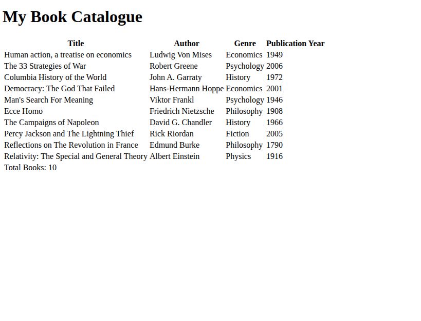

# Book Catalog Table

A structured table displaying a catalog of books with organized rows and columns.

## 📸 Preview

## 🎯 Project Goals
* **Objective:** Practice building structured tables.
* **Key Lessons:** Learned proper use of table elements like `<thead>`, `<tbody>`, and `<tr>`.

## 🛠️ Technologies Used
* **HTML5:** Table elements.
* **CSS3:** Table styling.

## 🚀 How to Run
1. Navigate to this folder: `cd Responsive-Web-Design-Certification/book-catalog-table`
2. Open `Book-catalog-table.html` in your browser.

## 📝 Acknowledgments
* This project was completed as part of the **freeCodeCamp** Responsive Web Design Certification.
* Instructions provided by the [freeCodeCamp Lab](https://www.freecodecamp.org/).
