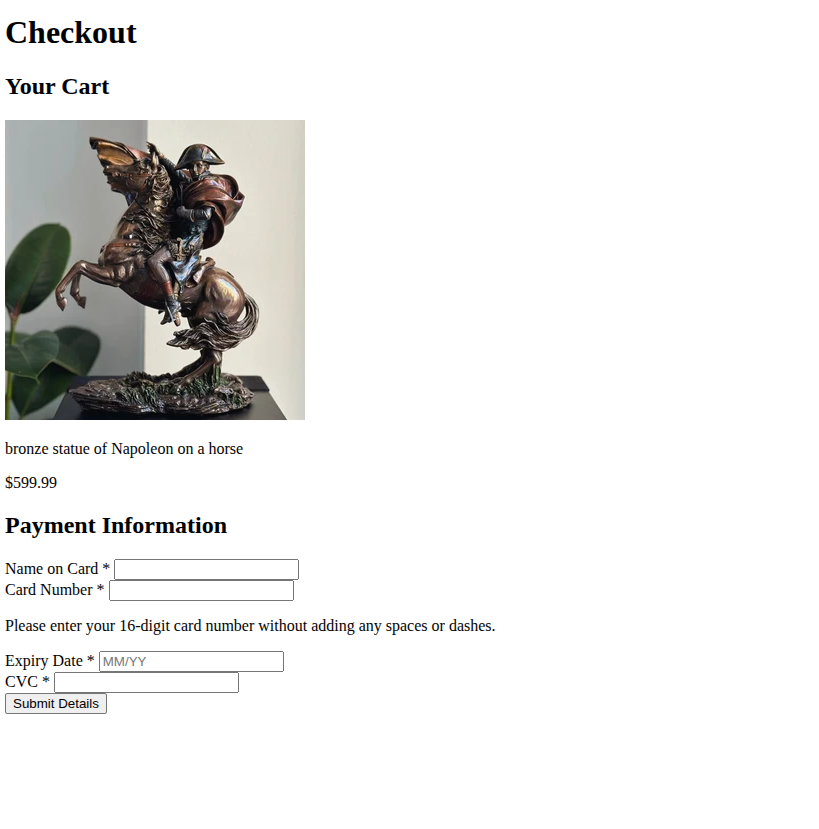

# Checkout Page

A mock checkout interface for collecting user payment and shipping details.

[Live Demo](https://tefol-hub.github.io/freeCodeCamp-Projects-and-Certs/Responsive-Web-Design-Certification/checkout-page/)

## 📸 Preview

## 🎯 Project Goals
* **Objective:** Build a structured checkout form.
* **Key Lessons:** Learned form inputs, labels, and layout design.

## 🛠️ Technologies Used
* **HTML5:** Form elements.
* **CSS3:** Layout and styling.

## 🚀 How to Run
1. Navigate to this folder: `cd Responsive-Web-Design-Certification/checkout-page`
2. Open `Checkout-Page.html` in your browser.

## 📝 Acknowledgments
* This project was completed as part of the **freeCodeCamp** Responsive Web Design Certification.
* Instructions provided by the [freeCodeCamp Lab](https://www.freecodecamp.org/).
