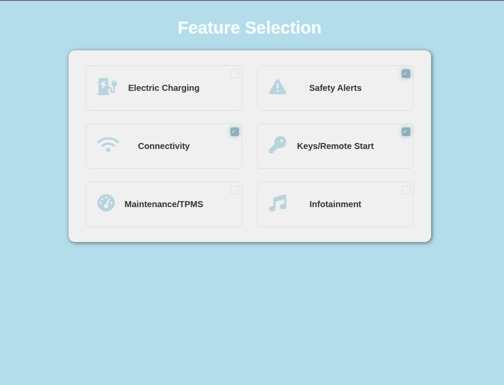

# Feature Selection Page

[Live Demo](https://tefol-hub.github.io/freeCodeCamp-Projects-and-Certs/Responsive-Web-Design-Certification/feature-selection-page/)
[Lab Instructions](https://www.freecodecamp.org/learn/responsive-web-design-v9/lab-feature-selection/design-a-feature-selection-page)

## 📸 Preview

## 🎯 Project Goals
* **Objective:** Design an interactive feature selection grid for a vehicle or service.
* **Key Feature:** Custom checkbox styling using `appearance: none` and FontAwesome icon integration.

## 🛠️ Technologies Used
* **HTML5:** Semantic labels and checkboxes.
* **CSS3:** Absolute positioning, hover effects, and custom checkbox states.
* **FontAwesome:** Scalable vector icons.

## 🚀 How to Run
1. Navigate to: `cd Responsive-Web-Design-Certification/feature-selection-page`
2. Open `index.html` in your browser.