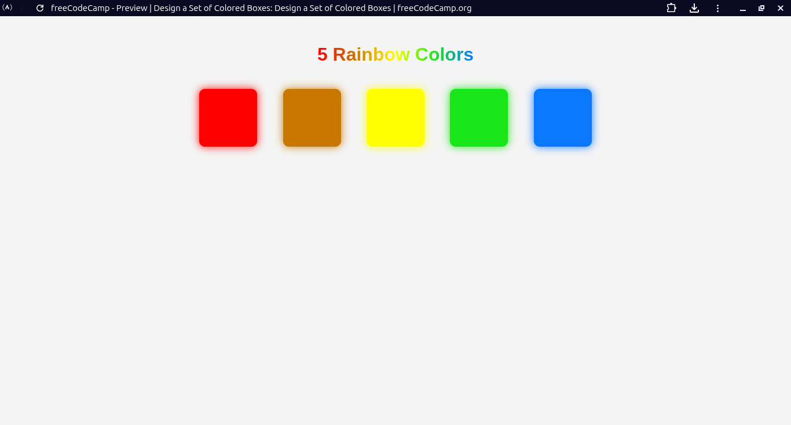

# Five Rainbow Color Boxes

A layout displaying five colorful boxes representing a rainbow.

## 📸 Preview

## 🎯 Project Goals
* **Objective:** Practice color styling and layout.
* **Key Lessons:** Learned CSS colors and box styling.

## 🛠️ Technologies Used
* **HTML5:** Structure.
* **CSS3:** Colors and layout.

## 🚀 How to Run
1. Navigate to this folder: `cd Responsive-Web-Design-Certification/five-rainbow-color-boxes`
2. Open `index.html` in your browser.

## 📝 Acknowledgments
* This project was completed as part of the **freeCodeCamp** Responsive Web Design Certification.
* Instructions provided by the [freeCodeCamp Lab](https://www.freecodecamp.org/).
