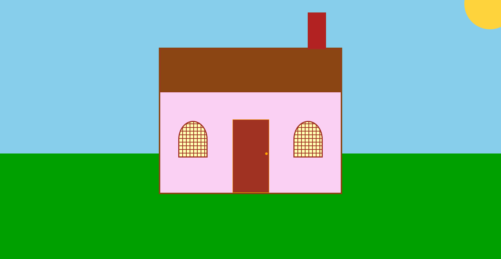

# House Painting CSS

[Live Demo](https://tefol-hub.github.io/freeCodeCamp-Projects-and-Certs/Responsive-Web-Design-Certification/house-painting-css/)
[Lab Instructions](https://www.freecodecamp.org/learn/responsive-web-design-v9/lab-house-painting/build-a-house-painting)

## 📸 Preview

## 🎯 Project Goals
* **Objective:** Build a digital illustration using only HTML and CSS.
* **Key Feature:** Created detailed window panes using multi-layered `repeating-linear-gradient`.
* **Layout:** Mastered the use of `z-index` and `position: absolute` to layer elements like the chimney behind the house.

## 🛠️ Technologies Used
* **HTML5:** Basic div-based structural skeleton.
* **CSS3:** Positioning, Border-radius, and Linear/Repeating Gradients.

## 🚀 How to Run
1. Navigate to: `cd Responsive-Web-Design-Certification/house-painting-css`
2. Open `index.html` in your browser.
