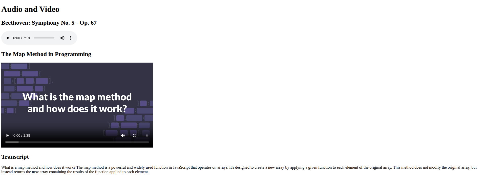

# Lab Multimedia Player

A multimedia player page integrating audio and video content.

## 📸 Preview

## 🎯 Project Goals
* **Objective:** Combine multiple media types into one interface.
* **Key Lessons:** Improved handling of multimedia elements.

## 🛠️ Technologies Used
* **HTML5:** Multimedia elements.
* **CSS3:** Styling.

## 🚀 How to Run
1. Navigate to this folder: `cd Responsive-Web-Design-Certification/lab-multimedia-player`
2. Open `Lab-Multimedia-Player.html` in your browser.

## 📝 Acknowledgments
* This project was completed as part of the **freeCodeCamp** Responsive Web Design Certification.
* Instructions provided by the [freeCodeCamp Lab](https://www.freecodecamp.org/).
