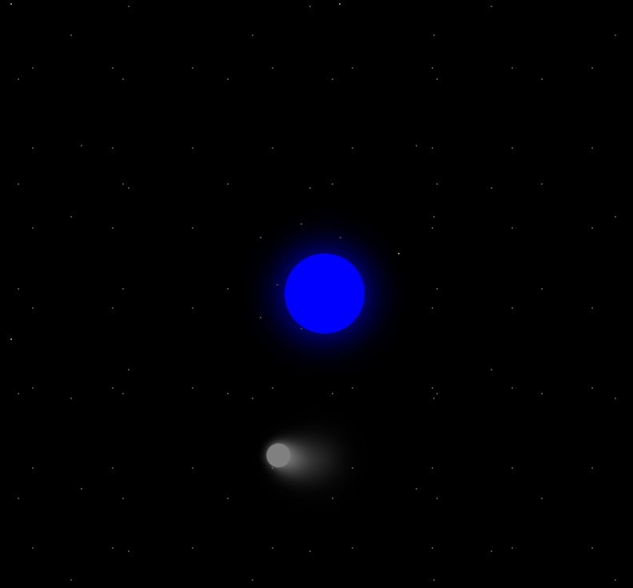

# Moon Orbit Animation

[Live Demo](https://tefol-hub.github.io/freeCodeCamp-Projects-and-Certs/Responsive-Web-Design-Certification/moon-orbit-animation/)
[Lab Instructions](https://www.freecodecamp.org/learn/responsive-web-design-v9/lab-moon-orbit/build-a-moon-orbit)

## 📸 Preview

## 🎯 Project Goals
* **Objective:** Master native CSS timelines, transformations, and timing functions.
* **Key Feature:** Created a realistic overlapping rotation loop by nesting the moving target element inside an animated structural wrapper parent.
* **Visual Tricks:** Stacked multiple `radial-gradient` rules to generate randomized, repeating background star clusters cleanly.

## 🛠️ Technologies Used
* **HTML5:** Compact, nested semantic structures.
* **CSS3:** `@keyframes` timelines, hardware-accelerated dimensional `transforms`, and multi-layer atmospheric box-shadowing.

## 🚀 How to Run
1. Navigate to: `cd Responsive-Web-Design-Certification/moon-orbit-animation`
2. Open `index.html` in your browser.