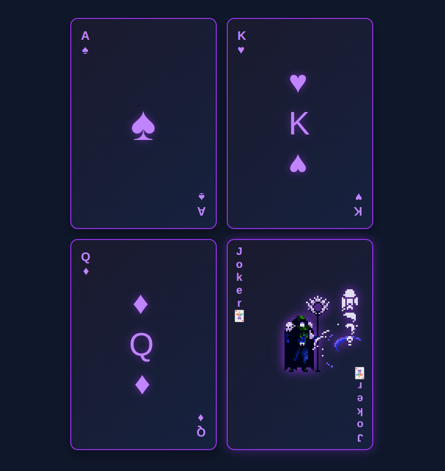

# Playing Cards UI

[Live Demo](https://tefol-hub.github.io/freeCodeCamp-Projects-and-Certs/Responsive-Web-Design-Certification/playing-cards-ui/)
[Lab Instructions](https://www.freecodecamp.org/learn/2022/responsive-web-design/#learn-css-animation-by-building-a-ferris-wheel)

## 📸 Preview

## 🎯 Project Goals
* **Objective:** Explore complex CSS animations and layout positioning.
* **Sprite Animation:** Implemented a 20-frame character animation using a sprite sheet and `steps(20)`.
* **Visual Effects:** Used `filter: hue-rotate()` and `@keyframes` to create a "chaos" effect on hover.
* **Layout:** Mastered `flex-flow` and `rotate` to mimic the mirrored layout of traditional playing cards.

## 🛠️ Technologies Used
* **HTML5:** Semantic card structure.
* **CSS3:** Keyframes, Sprite animations, Filters, and Flexbox.

## 🚀 How to Run
1. Navigate to: `cd Responsive-Web-Design-Certification/playing-cards-ui`
2. Ensure the `.png` sprite sheet is in the folder.
3. Open `index.html` in your browser.
