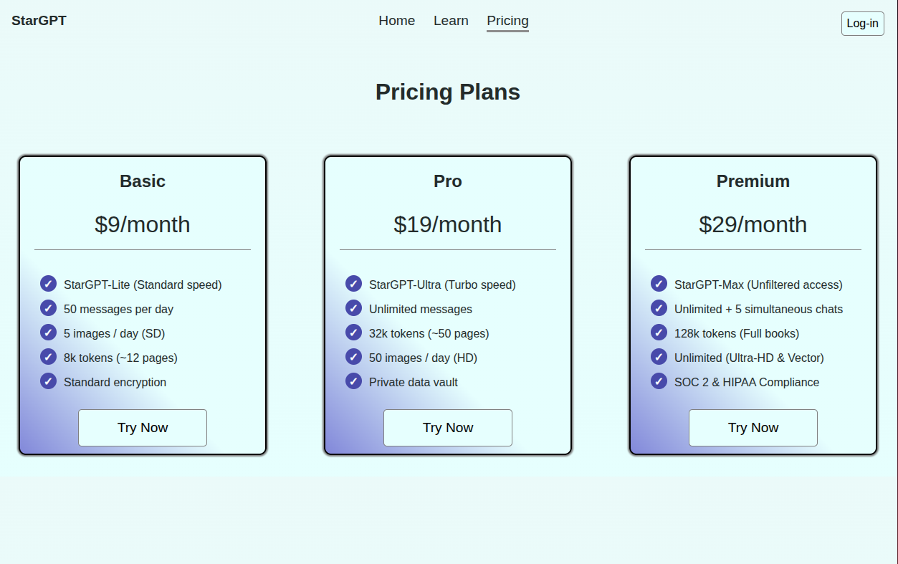

# Pricing Plans Layout

[Live Demo](https://tefol-hub.github.io/freeCodeCamp-Projects-and-Certs/Responsive-Web-Design-Certification/pricing-plans-layout/)
[Lab Instructions](https://www.freecodecamp.org/learn/responsive-web-design-v9/lab-pricing-plans-layout/design-a-pricing-plans-layout-page)

## 📸 Preview

## 🎯 Project Goals
* **Objective:** Create a multi-tiered subscription interface using responsive design.
* **Key Feature:** Implemented a "sliding gradient" background effect on hover using `background-size` and `background-position`.
* **Layout:** Utilized Flexbox `flex-grow` and `order` properties to manage card distribution.

## 🛠️ Technologies Used
* **HTML5:** Semantic header and container divs.
* **CSS3:** Flexbox, CSS Transitions, Linear Gradients, and Pseudo-classes (`:hover`, `:last-child`).

## 🚀 How to Run
1. Navigate to: `cd Responsive-Web-Design-Certification/pricing-plans-layout`
2. Open `index.html` in your browser.