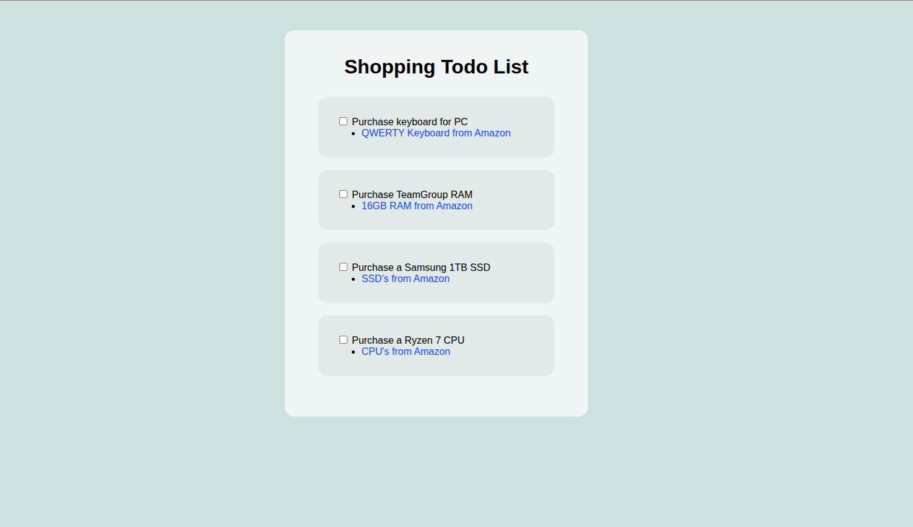

# Stylized To-Do List

A visually enhanced to-do list layout.

[Live Demo](https://tefol-hub.github.io/freeCodeCamp-Projects-and-Certs/Responsive-Web-Design-Certification/stylized-to-do-list/)

## 📸 Preview

## 🎯 Project Goals
* **Objective:** Design a clean to-do list interface.
* **Key Lessons:** Practiced styling lists and layout.

## 🛠️ Technologies Used
* **HTML5:** List structure.
* **CSS3:** Styling and layout.

## 🚀 How to Run
1. Navigate to this folder: `cd Responsive-Web-Design-Certification/stylized-to-do-list`
2. Open `index.html` in your browser.

## 📝 Acknowledgments
* This project was completed as part of the **freeCodeCamp** Responsive Web Design Certification.
* Instructions provided by the [freeCodeCamp Lab](https://www.freecodecamp.org/).
