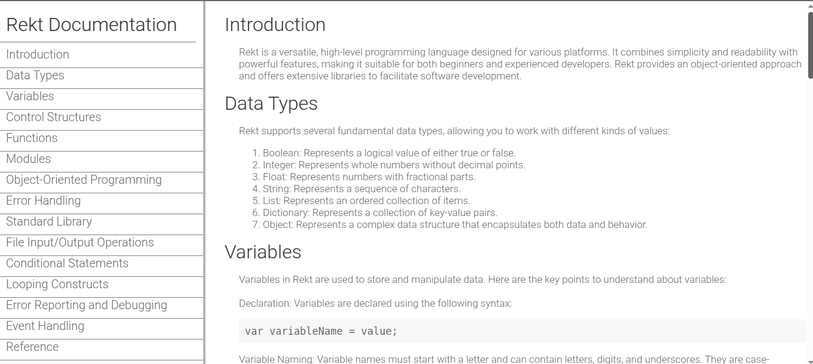

# Rekt Documentation – Technical Documentation Page

[Live Demo](https://tefol-hub.github.io/freeCodeCamp-Projects-and-Certs/Responsive-Web-Design-Certification/technical-documentation/)
[Lab Instructions](https://www.freecodecamp.org/learn/responsive-web-design-v9/lab-technical-documentation-page/build-a-technical-documentation-page)

## 📸 Preview


This project is a **responsive technical documentation website** built as part of the
[freeCodeCamp Responsive Web Design Certification](https://www.freecodecamp.org/).

It demonstrates the ability to design and structure clear, navigable documentation interfaces using **HTML and CSS**.

---

## 🚀 Live Demo

👉 https://tefol-hub.github.io/madeUpLanguageDocumentation/

---

## 💼 Project Highlights

* Built a **fully responsive layout** adapting to desktop and mobile screens
* Implemented a **fixed sidebar navigation system** for seamless content access
* Structured content using **semantic HTML** for accessibility and readability
* Designed a **documentation-style UI** similar to real-world developer docs
* Applied **clean CSS architecture** including layout control and media queries

---

## 🛠️ Tech Stack

* HTML5 (semantic structure)
* CSS3 (Flexbox, positioning, media queries)
* Google Fonts (Roboto)

---

## 📁 Project Structure

```id="nnt6yu"
index.html
Rekt-Documentation-styles.css
```

---

## 🧪 How to Run Locally

```bash
git clone https://github.com/tefol-hub/madeUpLanguageDocumentation.git
cd madeUpLanguageDocumentation
```

Then open `index.html` in your browser.

---

## 🎯 What This Demonstrates

* Ability to translate requirements into a **clean UI/UX**
* Strong understanding of **responsive design principles**
* Experience building **structured documentation layouts**
* Attention to **readability, hierarchy, and navigation**

---

## 🧠 Context

The documentation content is based on a **fictional programming language ("Rekt")**, created purely for demonstration.
The focus of this project is on **layout, structure, and usability**, not backend functionality.

---

## 📬 Contact

If you're interested in my work or would like to collaborate, feel free to connect.
