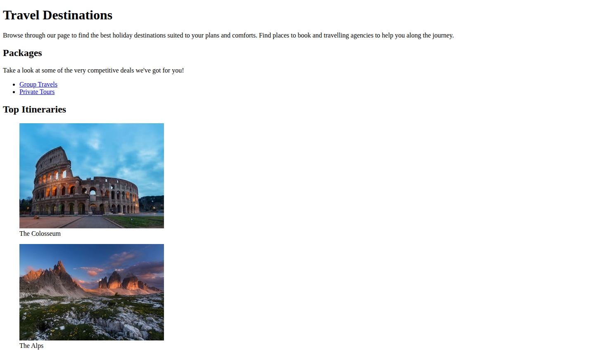

# Travel Agency Page

A promotional webpage for a travel agency.

## 📸 Preview

## 🎯 Project Goals
* **Objective:** Build a marketing-style webpage.
* **Key Lessons:** Learned layout design and content presentation.

## 🛠️ Technologies Used
* **HTML5:** Structure.
* **CSS3:** Layout and styling.

## 🚀 How to Run
1. Navigate to this folder: `cd Responsive-Web-Design-Certification/travel-agency-page`
2. Open `Travel-Agency-Page.html` in your browser.

## 📝 Acknowledgments
* This project was completed as part of the **freeCodeCamp** Responsive Web Design Certification.
* Instructions provided by the [freeCodeCamp Lab](https://www.freecodecamp.org/).
