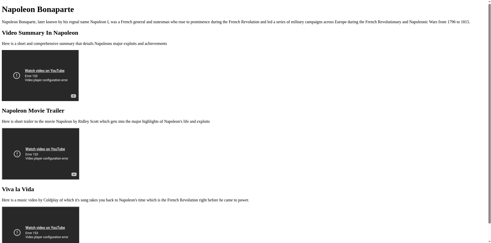

# Video Compilation Page

A webpage showcasing a collection of videos.

[Live Demo](https://tefol-hub.github.io/freeCodeCamp-Projects-and-Certs/Responsive-Web-Design-Certification/video-compilation-page/)

## 📸 Preview

## 🎯 Project Goals
* **Objective:** Display multiple videos in a structured layout.
* **Key Lessons:** Learned embedding and organizing video content.

## 🛠️ Technologies Used
* **HTML5:** Video embedding.
* **CSS3:** Layout styling.

## 🚀 How to Run
1. Navigate to this folder: `cd Responsive-Web-Design-Certification/video-compilation-page`
2. Open `Video-Compilation-Page.html` in your browser.

## 📝 Acknowledgments
* This project was completed as part of the **freeCodeCamp** Responsive Web Design Certification.
* Instructions provided by the [freeCodeCamp Lab](https://www.freecodecamp.org/).
